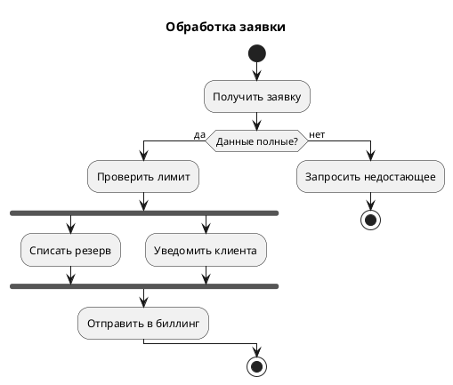
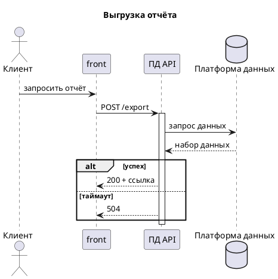
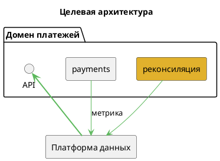
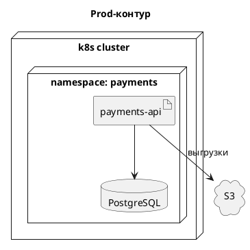
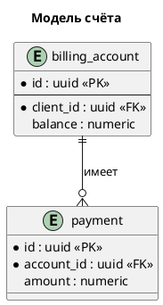
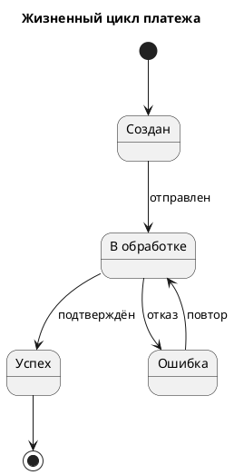
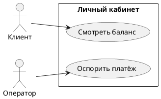
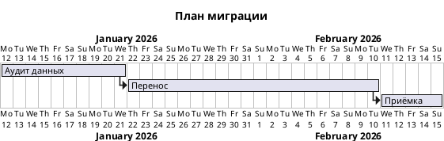
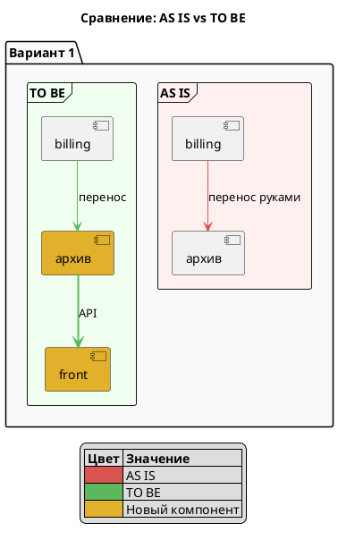

# Variant selection reference

Read this when the request's dominant question is unclear, or when you need a starting skeleton. Pick **one** primary variant, then write it in the user's language.

## Picking order

1. What changes over time? → behavior variants: Activity, Sequence, State, Timing.
2. What exists at rest? → structure variants: Component, Deployment, Class/ER, Use case.
3. Neither (plan, decomposition, comparison)? → Gantt/WBS, Mindmap, or a two-sided comparison layout.
4. Still ambiguous? Choose the cheapest variant that shows the answer and name the alternative in one line.

Ask "what will the reader do with this picture?" — a debugging aid wants a sequence, a design review wants components, a management update wants activity or comparison.

The skeletons below are for the chat proposal: write the candidate in the user's language, post its full source, and let the user pick or correct before any file is written. Skeleton switching mid-conversation is normal — the variant is agreed in dialogue, not committed to disk on first guess.

## Activity (new syntax) — processes, algorithms, step-by-step

Signals: процесс, алгоритм, шаги, сценарий, как это работает, workflow, BPMN, "from request to result", decision branches, manual vs automatic steps.

Notes: swimlanes via `|Отдел|` before a step; `partition "Этап" { ... }` groups stages; `->` labels on `if` branches read better than bare yes/no; use `detach` for terminals you do not want drawn as a filled circle.

## Sequence — interactions, API calls, message order

Signals: обмен, API, запросы, интеграция, вызовы, "кто кого вызывает", handshake, retries, timeouts, protocol.

Notes: `activate`/`deactivate` or `++`/`--` show scope; `alt`/`opt`/`loop`/`par` cover control flow; `autonumber` numbers the messages; group long sequences with `== Этап ==`.

## Component — architecture, services, integration map

Signals: архитектура, из чего состоит, сервисы, модули, интеграции, схема системы, зависимости, "landscape".

Notes: `package`/`frame`/`rectangle` for boundaries; `#E1B12C` marks components that are new in the target state; add a `legend` when colors carry meaning; keep the arrow count low — arrows are the message, boxes are just nouns.

## Deployment — environments, nodes, infrastructure

Signals: окружения, ноды, кластеры, развёртывание, инфраструктура, где что живёт, prod/dev, Kubernetes, сети.

Notes: `node`, `cloud`, `database`, `artifact`, `storage`; nest nodes for real containment; label protocols and ports on the arrows.

## Class / ER — domain model, database schema

Signals: модель данных, сущности, таблицы, поля, связи, БД, домен, cardinality, "один ко многим".

Notes: `entity` for ER/IE crow's-foot notation, `class` for UML class diagrams; `*` marks required, `--` separates fields from methods, `<<PK>>` documents keys; include only attributes the reader needs — a full schema is a document, not a diagram.

## State — lifecycles, statuses, state machines

Signals: статус, состояния, жизненный цикл, переходы, "что дальше", state machine, retry.

Notes: `state "name" as alias { ... }` for composite states; `[*]` is the initial/final pseudo-state; label transitions with events, not with prose. State names are identifiers — always give non-ASCII or multi-word states an explicit `as` alias, or the server rejects the diagram at the first transition.

## Use case — actors and capabilities

Signals: роли, акторы, кто что может, возможности, требования, "сценарии использования".

## Gantt and WBS — plans and decomposition

Signals: сроки, этапы, план, дорожная карта, декомпозиция, work breakdown, кто за что отвечает.

Notes: `@startwbs` with `*` nesting gives the decomposition tree; `@startmindmap` is the free-form brainstorm variant. Use these only when time or hierarchy *is* the answer.

## AS IS / TO BE comparison

Signals: AS IS / TO BE, было / стало, сравнить, до и после, целевой процесс, варианты решения.

Build one diagram with one container per side so the reader compares left to right:

Notes: keep both sides on the same variant and the same element names so differences pop; more than two options or more than ~15 elements per side needs one diagram per option instead.

## Also available

`timing` for signal timing across concurrent participants, `object` for one instance snapshot, `json`/`yaml` for annotated payload structure, `salt` for UI wireframes, `nwdiag` for network zones. Reach for them only when the request names the need.

## Checked against the renderer, not the docs

PlantUML tolerates some sloppy syntax — an unterminated label can still parse and silently swallow following lines. Always render (or at least `check`) before delivering, and read the image for any diagram with long non-ASCII labels.

Checking uses a scratch copy in the temp directory, never a file in the user's project (`SKILL.md` §3, "Propose in chat"). The diagram reaches the user's disk only after they confirm the save; a variant shown in chat is a proposal, not a saved artifact.
