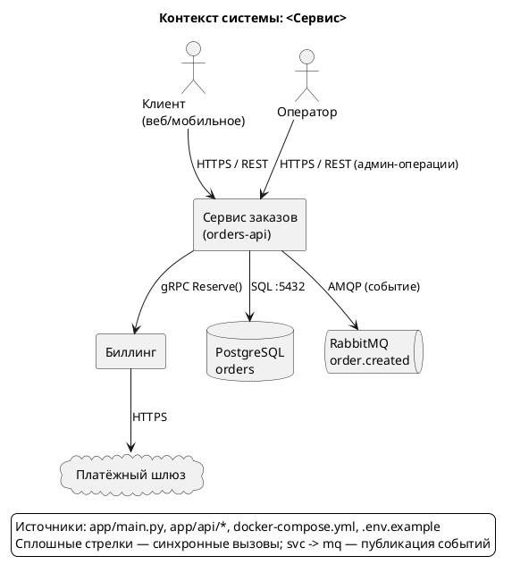
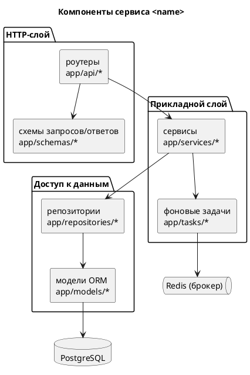
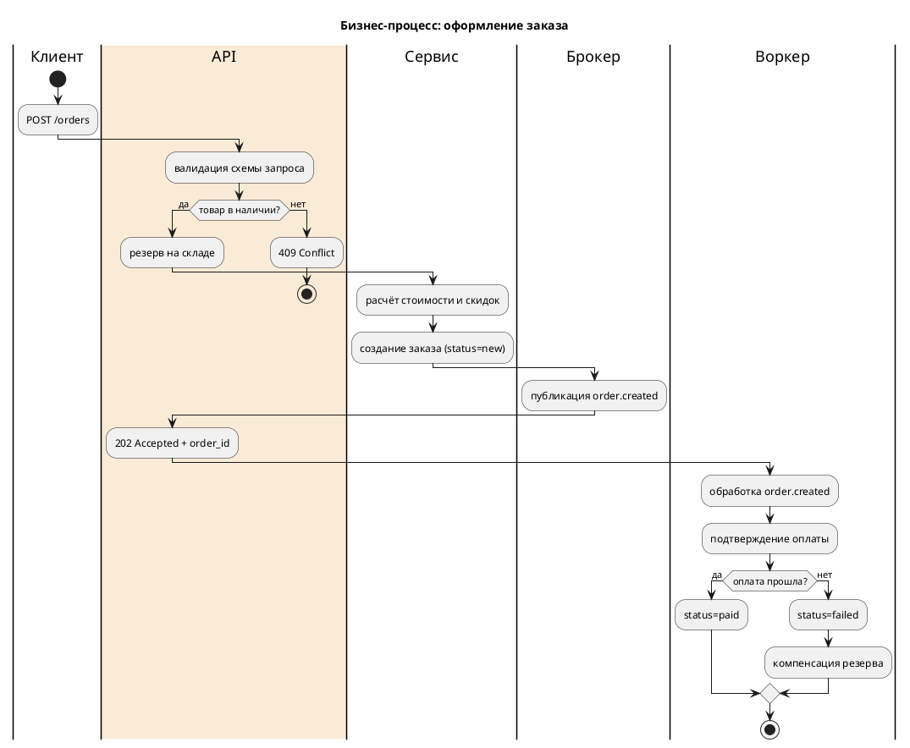
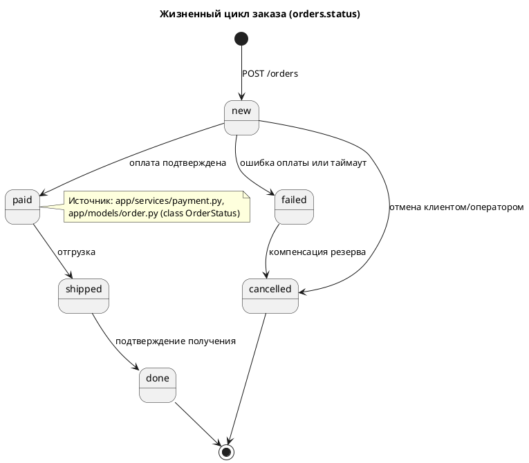
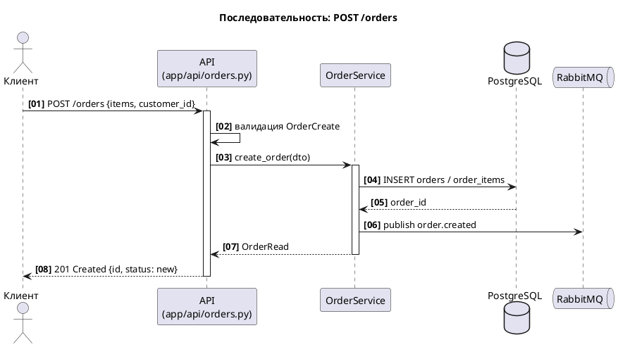
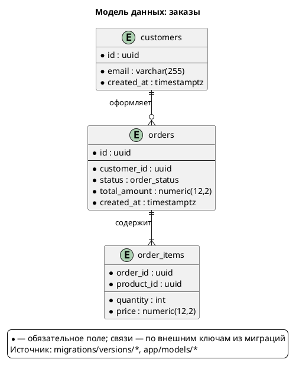
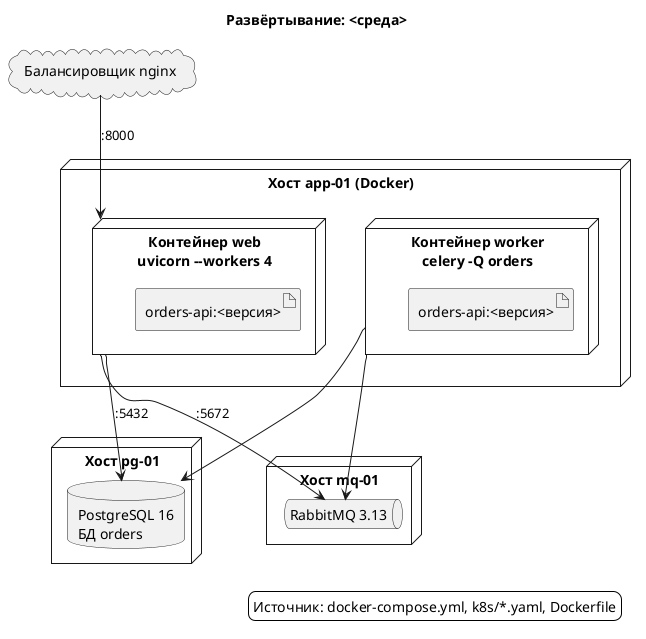
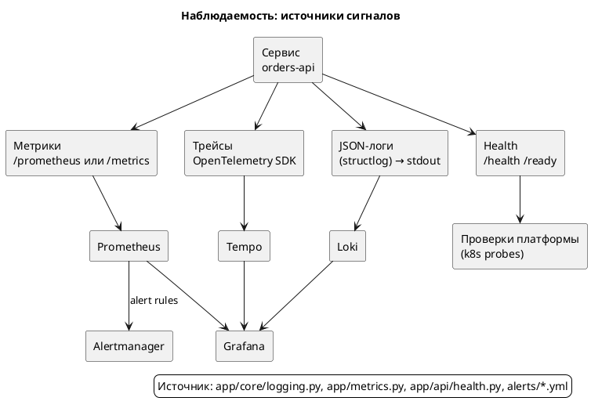

# PlantUML diagrams for the tech doc

Every skeleton below passed `check` and was rendered; copy them and replace the facts with real ones. One
file per diagram. Mandatory: `@startuml`/`@enduml`, `title`, explicit `skinparam`, and a `legend` listing
the code sources behind the facts (traceability, not decoration). Diagram labels and legends stay in
Russian — that is the document language.

## Section → diagram

| § | Primary diagram | Add when |
|---|---|---|
| 1 Overview | Context (component: system + outside world) | — |
| 2 Business Logic | Activity with swimlanes per role/component | State — entity lifecycle; Sequence — when transactions matter |
| 3 Architecture | Components inside the service + Deployment | Sequence — cross-system scenario |
| 4 API & Contracts | Sequence for 1–2 key scenarios | Component — event flow between services |
| 5 Data Model | ER (`entity`) per domain | Class — when domain types and methods matter |
| 6 Configuration | Deployment, when config differs per environment | — (tables usually suffice) |
| 7 Monitoring | Observability map (sources → collectors → dashboards) | State/Sequence — only if they explain diagnostics |

## Rules

- One diagram answers one question; never mix sequence and component.
- Up to ~30 elements; more — split into an overview plus per-scenario detail.
- Explicit aliases: `component "Сервис заказов (orders-api)" as svc`, then only `svc`. ASCII aliases,
  Russian labels.
- Arrow colors by meaning: `-[#D9534F]->` failure/current, `-[#5CB85C,bold]->` target/happy path. The
  legend must match the colors.
- `legend` lists the source files behind the facts; if a diagram rests on a guess, say so.
- In a section, put the diagram after the paragraph it illustrates, with a caption and a link to the
  `.puml` for edits.
- Files: `docs/diagrams/<topic>.puml` + same-name `.png`. Topics: `context`, `components`,
  `business-flow`, `order-lifecycle`, `api-sequence`, `data-model`, `deployment`, `observability`.

## Check and render (mandatory)

Node from `load_workspace_dependencies`; `<plantuml-skill>` is the base directory of the `plantuml` skill:

```sh
node "<plantuml-skill>/scripts/plantuml.mjs" check  docs/diagrams/context.puml
node "<plantuml-skill>/scripts/plantuml.mjs" render docs/diagrams/context.puml -o docs/diagrams/context.png
```

`check` prints ASCII art or fails with the server's line number. After rendering, read the PNG **as an
image**: clipped labels, overlapping boxes, arrows across the whole canvas, legend/color mismatch, text
too small. Fix the source and re-check. A diagram without a passing `check` and a reviewed `render` never
enters the document.

---

## 1. System context



## 2. Service components



## 3. Business process (activity with swimlanes)



## 4. Entity lifecycle (state)



## 5. API scenario (sequence)



A failure path is a second diagram of the same shape with `alt`/`else`, or a separate file
`api-sequence-error.puml` (timeout, retry, rollback).

## 6. Data model (ER)



Cardinalities: `||--o{` one-to-many, `||--||` one-to-one, `}o--o{` many-to-many (with the join table as
its own entity). Always reconcile the schema against the **latest** migration, not the model alone.

## 7. Deployment



## 8. Observability



---

## AS IS / TO BE

Separate files `as-is/*.puml` and `to-be/*.puml` of the same diagram; each carries a legend stating the
color meaning: `-[#D9534F]->` current state, `-[#5CB85C,bold]->` target state. Place them side by side in
the document and list the differences below. Never draw the same content in two notations.

## Common failures

| Symptom in the PNG | Cause in the source |
|---|---|
| An arrow crosses the whole canvas | No intermediate nodes or `package` grouping |
| Labels are clipped | Text too long without `\n`; split into lines |
| Legend does not match the colors | Colors were added after the legend was written |
| Diagram does not fit a page | More than ~30 elements: split by scenario |
| Schema disagrees with migrations | The model was taken from code without checking the latest migration revision |
